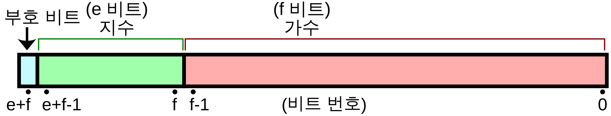
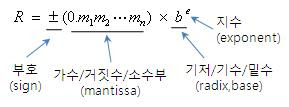

# 데이터

## 이진수와 2의 보수

컴퓨터는 0과 1만을 이해한다.

- 모든 양수를 0과 1로 표현: 이진수
- 모든 음수를 0과 1로 표현: 2의 보수
- 모든 소수를 0과 1로 표현: 부동소수점
- 모든 문자를 0과 1로 표현: 문자 집합 & 인코딩

### 이진법(이진수)

- 0과 1로 모든 수를 표기
- 이진법을 사용하면 숫자가 길어짐 -> 16진법으로 표현(0~9와 A~F로 모든 수를 표기)

### 2의 보수법

- 어떤 수 n을 그보다 큰 2^n에서 뺀 값
- 모든 0과 1을 뒤집은 뒤 1을 더한 값
- CPU의 플래그 레지스터가 음수 플래그를 세팅하여 음수를 표현함을 알 수 있음
  - 플래그: CPU가 명령을 실행하는 과정에서 참고할 정보의 모음

## 부동소수점(floating point)





- 부동소수점의 한계

```js
const a = 0.1;
const b = 0.2;
const c = 0.3;
a + b === c;

// false
```

- 이진수를 m \* 2^n 방식으로 나타내고, 가수 부분은 1.xxx 꼴을 띄고 있음
- 십진수 소수를 이진수로 변환할 때 십진수 소수와 이진수 소수 표현이 일치하지 않을 수 있음

## 문자 인코딩과 디코딩

- 문자 집합(character set): 표현 가능한 문자들의 집합
- 문자 인코딩: 문자를 0과 1로 이루어진 문자 코드로 변환
- 문자 디코딩: 0과 1로 이루어진 문자 코드를 문자로 변환

### 아스키 코드(ASCII)

- 아스키 문자 집합
  - 알파벳
  - 아라비아 숫자
  - 일부 특수 문자
  - 제어 문자
- 코드표에 정의된 문자에 대한 대응이 곧 인코딩
- 7bit (127개)로 표현 (확장 ascii는 8bit)

### 유니코드(UTF-8, 16, ...etc)

- 유니코드 문자 집합
  - 대부분의 언어
  - 특수문자
  - 이모티콘
  - 화살표 등
- 유니코드 코드 포인트: 유니코드 문자에 부여된 고유한 수
- 코드포인트를 인코딩하는 방식에 따라 UTF-8, UTF-16, UTF-32 등으로 나뉨
